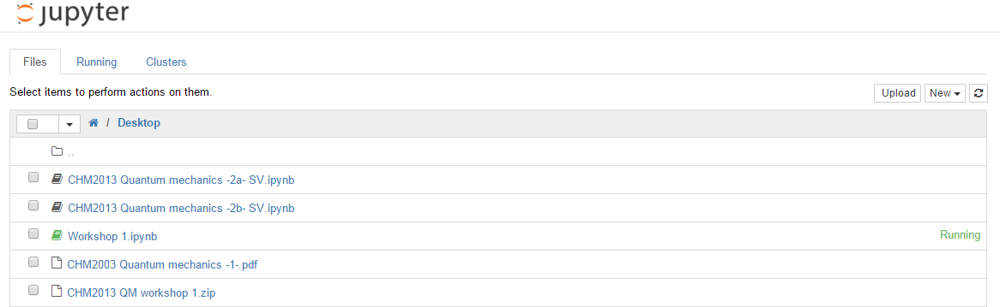
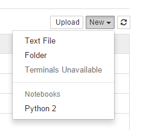
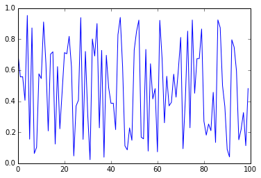

---
layout: page
title: "Workshop 1"
use_math: true
--- 
# Installation of Anaconda Python and the Jupyter Notebook
Before we start coding we have to download the software we need to do so. The lastest version of the Anaconda 2 installer can be downloaded from 
[https://repo.anaconda.com/archive/Anaconda2-5.3.1-Windows-x86_64.exe](https://repo.anaconda.com/archive/Anaconda2-5.3.1-Windows-x86_64.exe)

The download is around 580 Mb, so it may take some time, depending on the speed of your internet connection. 
Once downloaded, run the Anaconda2-5.3.1-Windows-x86_64.exe by double clicking on it. This will start the installation process. Follow the instructions to complete the installation (I recommend using the default installation settings). This process could also take a while.

Once the installation is complete you can start Jupyter notebook by going in the Windows start menu, typing “Jupyter” and clicking on “Jupyter Notebook”.

This will initially open a black command line window, where some text will appear. It is important that you DO NOT CLOSE this window, as it contains the Python “server” that will allow us to use Python from within the Jupyter Notebook, which runs inside your web-browser, which will open shortly after.

# Introduction to the Jupyter Notebook
By the end of this workshop you should be able to:

* start the Jupyter Notebook, open an existing notebook and create a new one.
* use the Jupyter Notebook environment to carry out scientific calculations.
* create short programs using numerical variables. 
 
## What is the Jupyter Notebook?
The Jupyter Notebook (previously IPython Notebook) is an interactive computing
environment that enables you to author notebook documents that include:

* Live code
* Interactive widgets
* Plots
* Text
* Equations
* Images
* Video

These documents provide a complete and self-contained record of a computation
that can be converted to various formats and shared with others.

The Jupyter Notebook combines 2 components:

* The notebook user interface: an interactive web application for writing and
running code interactively and authoring notebook documents.
* The kernels: Separate process started by the notebook web application that
runs users' code in a given language (in our case Python) and returns output
back to the notebook web application.

In this workshop we will introduce the user interface. 
 
## The Notebook dashboard

When you first start the Jupyter Notebook server, your web-brower will open to the notebook
dashboard. The dashboard serves as a home page. Its main purpose is to display
the notebooks (files with **.ipynb** extension) and other files in the current
directory. For example, here is a screenshot of the dashboard page for the
Desktop on my own computer:

You'll see a list of subdirectories and files. It is possible to navigate the
file system and open files by clicking on the subdirectories or the file names
in the list.

Navigate to Documents or to OneDrive (better because it will back-up your files on the cloud), create a new folder using the “New” menu at the top right corner. Name the folder CHM1016_Python. This is the folder where your notebooks will be saved. You can then open the folder you created.

Now you are ready to start coding.

To create a new notebook, click on the "New" button at the top of the list and
select a file type from the dropdown (as seen here).

Go ahead and create a new notebook of *Python 2* type on the Desktop of your
computer. 
 
 
## The notebook user interface
If you create a new notebook or open an existing one, you will be taken to the
notebook user interface (UI). This UI allows you to run code and author notebook
documents interactively. The notebook UI has the following main areas:

* Notebook name
* Menu
* Toolbar
* Notebook area and cells

The notebook has an interactive tour of these elements that can be started in
the "Help -> User Interface Tour" menu item.

Start the User Interface Tour and follow the instruction to change the file name
to **Workshop 1**, then close the User Interface Tour.

The notebook area consist of a linear sequence of cells. There are four basic
cell types:

* Code cells: Input and output of live code that is run in the kernel
* Markdown cells: Formatted text where also HTML code and LaTeX equations can be
embedded. This cell you are reading now is a markdown cell.
* Heading cells: 6 levels of hierarchical organization and formatting (similar
to headings in MS Word)
* Raw cells: Unformatted text

All navigation and actions in the Notebook are available using the mouse through
the menubar and toolbar. Cells can be selected by clicking on them. If you click
inside a cell's editor area, you will enter edit mode. If you click on the
prompt or output area of a cell you will exit edit mode.

Actions usually apply to the currently selected cell. Thus if you want to run
the code in a cell, you would select it and click the
 button in the toolbar or the "Cell -> Run"
menu item. Similarly, to copy a cell you would select it and click the
  button in the toolbar or the "Edit ->
Copy" menu item. With this simple pattern, you should be able to do everything
needed to complete this series of workshops. 
 
# Introduction to Python programming 
 
## Let's start coding

Click in the first cell's editor area and type

    print "Hello, World!"

This is the starting point of any computer programming course and all that this
short program will achieve is to output **Hello, World!** to the screen.
However, I'd like you to appreciate the simplicity of this operation in Python.
You could spend a couple of minutes searching the internet and you'll find out
that the code needed to achieve the same output using different computer
languages is often much more complex that this.

Run the code you just typed in the cell, either by clicking the
 button, or by pressing the SHIFT and ENTER
keys on your keyboard at the same time. You will see the expected output to
appear in the output area of the cell.

In my example, you will also see I typed some text preceded by the **#**
character. Every line started by **#** is a **comment**. This means it will be
ignored by the Python interpreter when the program runs. Commenting your code is
a very useful practice to ensure you can know exactly what you were attempting
to do in each part of your code. It also makes it easier for anyone else to read
your code and understand what's going on. Code readability is extremely
important, especially in group-work. 

**In [1]:**


# My first Python program
# It prints "Hello, World!" to screen
print "Hello, World!"


    Hello, World!
    
 
I will now show you how easy it is to create graphs in this environment.
However, before we do that I will ask you to copy and execute the code contained
in the cell below. This will import the **matplotlib** and the **numpy**
library. Matplotlib contains all the functions needed to generate graphs, while
numpy contains a lot of maths function (and so much more, as we'll see later
on). ensure that the graphs will app. The first line of code will also ensure
that the graphs will be generated inside the notebook, rather than in an
external window. 

**In [2]:**


%pylab inline             
from matplotlib import *  


which will generate the following output:

    Populating the interactive namespace from numpy and matplotlib
    
 
Let's generate a plot of 100 random numbers. Type

    plot(rand(100))

and run the program. You may notice that the plot generated on your computer
screen is different from that of your neighbour; this is because the numbers
have been generated at random. 

**In [3]:**


plot(rand(100))


The output will be

    [<matplotlib.lines.Line2D at 0xa576470>]

 
 

 
## Using Python as a Calculator 
 
A notebook can be used as a scientific calculator. 

**In [4]:**


3 + 8


    11

 
Since we have imported the **numpy** module, the values of some of the constants
most commonly used, such as **pi** and **e**, are now defined and can be used in
our calculations. 

**In [5]:**


pi


    3.141592653589793

**In [6]:**


e


    2.718281828459045

**In [7]:**


(3 - e) * (pi / 2)


    0.4425218690479065

**In [8]:**


4 ** 2


    16

 
So far, we've seen two different data types: **integers**, also known as *whole
numbers* to the non-programming world, and **floating point numbers**, also
known as *decimal numbers*. 
 
In Python 2.7 the division operation could lead to unexpected results: 

**In [9]:**


8 / 5


    1

 
Python integer division, like in a few other programming languages, truncates
the remainder and returns an integer. So, how do we obtain the correct result?
We simply turn one of our numbers into a floating point real number by adding
one decimal digit to it. 

**In [10]:**


8.0 / 5


    1.6

 
The Python **numpy** and **math** modules contains many useful scientific
functions, such as square root, natural and base 10 log and trigonometric
functions. 

**In [11]:**


# square root
sqrt(9)


    3.0

**In [12]:**


#natural log
log(10)


    2.3025850929940459

**In [13]:**


# log base 10
log10(10)


    1.0

**In [14]:**


sin(pi)


    1.2246467991473532e-16

 
We would have expected the $\sin(\pi)$ to be 0. The number $\pi$ cannot be
represented exactly as a floating-point number. So, this introduces some
rounding errors. 

**In [15]:**


cos(pi)


    -1.0

 
## Working with variables 
 
In programming, a variable is a symbolic name for something (such as a numerical
value, a sequence of characters or any other type of information). While we code
our programs, we can use a variable name in place of its associated value.
Programmers use these variable names to make their code more readable, and
because it makes it easier to remember what is going on in the code. It is
important to use meaningful/memorable names for variables.

Today we will be working only with numerical variables. 
 
The assignment operator in Python is =. Python is a dynamically typed language,
so we do not need to specify the type of a variable when we create one.
Assigning a value to a new variable creates the variable: 

**In [16]:**


# variable assignments
a = 1
temperature = 50
my_variable = 1.4
print a
print temperature
print my_variable


    1
    50
    1.4
    
 
Although not explicitly specified, a variable does have a type associated with
it. The type is derived form the value it was assigned 

**In [17]:**


print type(a)
print type(my_variable)


    <type 'int'>
    <type 'float'>
    
 
You can name a variable *almost* anything you want. It needs to start with an
alphabetical character or the underscore character \_ and it can contain any of
the alphanumerical characters a-z, A-Z, 0-9 and some special characters such as
\_ . Variable names are case sensitive. Certain words, however, are reserved for the language:

    and, as, assert, break, class, continue, def, del, elif, else, except,
    exec, finally, for, from, global, if, import, in, is, lambda, not, or,
    pass, print, raise, return, try, while, with, yield

Trying to define a variable using one of these will result in a syntax error. 
 
Now we can do calculations using variables.
Type

    a = a + 1

This expression would make no sense in maths, but in the world of programming it
works perfecty: it increases the value of **a** by 1. 

**In [18]:**


# increase the value of a by 1
a = a + 1 
print a


    2
    
 
Another example: 

**In [19]:**


# calculate the area of the front face of a cuboid 
height = 20
length = 40
area = length * height
print area


    800
    
 
Let's now try to print the value of a variable that has not been defined yet.
Type:

    print volume

and run the code.
The variable volume is not defined so we'll get an error. When our code does not
work as we would like, and we get error messages from the Python interpreter,
it's important to read the error message, as it will point you in the right
direction on how to fix the problem with your code. 

**In [20]:**


print volume 


    ---------------------------------------------------------------------------

    NameError                                 Traceback (most recent call last)

    <ipython-input-20-8a3a52ac4251> in <module>()
    ----> 1 print volume
    

    NameError: name 'volume' is not defined

 
Let's fix that code, by assigning a value to the **volume** variable. 

**In [21]:**


# calculate the volume of the cuboid
depth = 10
volume = area * depth
print volume


    8000
    
 
## Applications
Using the basic programming concepts we learnt so far, create 2 short programs
to solve the problems described below. 
 
1)Write a program that converts the temperature from Fahrenheit to Celsius and
prints the result to screen.

The formula for this unit conversion is :
$C = \frac{5}{9} (F-32)$
Test your code with temperature values of 32 F and 212 F to verify that your
code produces the expected results. 
 
2)Write a program that converts the temperature from Celsius to Fahrenheit and
prints the result to screen.
Test your code with temperature values of 0 C and 100 C to verify that your code
produces the expected results. 
 
**VERY IMPORTANT**
After you complete these 2 tasks, you should save your notebook and, as
previously explained, you should back it up!!! 
