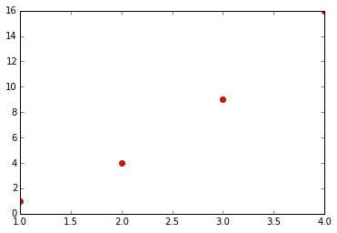
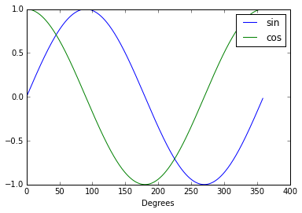
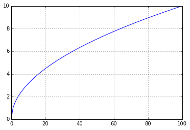

---
layout: page
title: "Workshop 3"
use_math: true
--- 
# Introduction to Python programming -3- 
 
By the end of this workshop you should be able to:

* use boolean and comparison operators in your short programs
* control the flow of the program using conditional statements
* define functions that perform simple tasks
* plot data in a scatter graph
* read from and write to a text file.
 
 
## First of all... 
 
Just as we did in the previous 2 workshops, we have to start the Jupyter
notebook, create a new notebook on the "Desktop" folder and rename the new
notebook **Workshop 3**.

Then type and run the code that loads the libraries needed for graph plotting
and calculations. 

**In [1]:**


%pylab inline
from matplotlib import *


    Populating the interactive namespace from numpy and matplotlib
    
 
## Boolean operators 
 
Last week we introduced the concept of boolean variables, which can only have
value **True** or **False**. Today we'll introduce boolean and comparison
operators.
The boolean operators are spelled out as words **and**, **not**, **or**.

The following table shows that when we join 2 statements with the **and**
operator, the resulting expression is true only if both statement 1 and
statement 2 are true.

| and       | True  | False |
|-----------|-------|-------|
| **True**  | True  | False |
| **False** | False | False |

In the case of the **or** operator, the resulting expression is true only if at
least one of the 2 statemens is true and it's false only if both statements are
false.

| or        | True  | False |
|-----------|-------|-------|
| **True**  | True  | True  |
| **False** | True  | False |

Finally the truth table for the **not** operator. This operator takes only one
argument. If the argument is true, the **not** operator returns false, and
viceversa.

| not       | True  | False |
|-----------|-------|-------|
|           | False | True  |

Test that the boolean operators in Python behave as expected by typing and
running the content of the folowing 3 cells. 

**In [2]:**


True and False


    False

**In [3]:**


True or False


    True

**In [4]:**


not True


    False

 
## Comparison operators 
 
The comparison operators, as the name suggests, compare the value of two
expressions and return a **True** or **False** value. Comparison operators are
**>** (greater than), **<** (less than), **>=** (greater or equal), **<=** (less
or equal), **==** equality, **!=** inequality.

While the **>**, **>=**, **<** and **<=** are mostly used with numerical values,
the equality and inequality operators can be applied to any type of variable.

The following cells show applications of the comparison operators. Type and run
the code of these cells. Feel free to modify the code of these cells and test
the results of these comparison operations. 

**In [5]:**


1 > 2


    False

**In [6]:**


2.1 > 2.0


    True

**In [7]:**


1.9 >= 1.9


    True

**In [8]:**


"Hello" == "Hello"


    True

**In [9]:**


[1,2,3] != [0,1,2]


    True

**In [10]:**


a = 3
b = 5
a <= b


    True

 
## Conditional statements: if, elif, else 
 
So far the simple programs we created were made up of a linear series of
instructions to be executed sequentially. In [Workshop 2](workshop-2) we also introduced a way
to loop through lists. When coding, it is often useful to execute different
parts of the code according to the circumstances. Therefore we need to introduce
the conditional statements.

We can use the **if...elif...else** statement to control the flow of the program
and execute different code according to whether certain expressions are true or
false. **elif** stands for *else if*.

First type this code out and run it and observe the output. Then change the day
to **"Monday"** and check if the output changes.

**IMPORTANT:** note the use of indentation (4 spaces to the right) to define the
block of instruction to be executed if the expression in the **if** statement is
**True**. 

**In [11]:**


day = "Sunday"
if day == "Sunday":
    print "Sleep in"



    Sleep in
    
 
Now let's create a more complex structure, where the code reacts to 2 different
situations.
Type and run the following code. Observe its output. Then change the value of
the **day** variable to **"Sunday"** and run the code again. Does the output
change?

Once more, notice the use of indentation to define the **if** block and the
**else** block. 

**In [12]:**


day = "Friday"
if day == "Sunday":
    print "Sleep in"
else:
    print "Go to Uni"



    Go to Uni
    
 
One final example of code that has 3 different possible outputs. Type it and run
it as is, and then try to assign different values to the **day** variable. 

**In [13]:**


day = "Friday"
if day == "Sunday": 
    print "Sleep in"
elif day == "Saturday":
    print "Go out"
else:
    print "Go to Uni"


    Go to Uni
    
 
Another example involving a **for** loop and an **if...elif...else** statement.

Before running this code, read it thouroughly and try to work out what kind of
output this short script will produce. The type and compare the output with what
you were expecting. 

**In [14]:**


a_list=[1,3,-5,0,9,-3.2,0]
for n in a_list:
    if n>0:
        print str(n) + ' is positive'
    elif n<0:
        print str(n) + ' is negative'
    else:
        print 'zero'


    
 
## Functions 
 
In a large program the code is usually divided into smaller units which perform
a certain task. This is particularly useful when the task is repeated often in
the code and it helps keeping the code readable and tidy. The smaller units are
called **functions**. We define functions in Python with the **def** keyword
followed by a colon. The task carried out by the function is defined by an
indented block. This is called the *body* of the function. Once the function is
defined, it can be executed when needed by *calling* the function.When a
function is called, the statements inside the function body are executed.
To call a function, we specify the function name with the round brackets.

Try out the following code: it defines a function called **say_hello()** which
executes a single statement (printing *Hello* to screen). The function is then
called, as shown. You do not need to type my comments to the code. They are
there just to clarify things. 

**In [15]:**


# this is a function
def say_hello():  # function definition
    print "Hello" # body of the function

# this is the main code    
say_hello() # here the function is called


    Hello
    
 
The first function we defined took no arguments. However it is also possible to
pass **arguments** to a function. The arguments of a functions are specified
inside the brackets after the function name. If a function takes more than one
argument, these must be separated by commas. The definition of a generic
function taking 3 arguments would look like: **def my_func(arg1, arg2, arg3):**

In the following example the function **say_hello_to(who)** takes one argument.
When the function is called, we pass the argument inside the brackets (in this
case the string **"John"**.  This is assigned to the variable **who** and the
function body is executed.
Type and run the following example. Then attempt to modify it, so that the
function takes two arguments, so that we can use it to say hello to 2 people. 

**In [16]:**


def say_hello_to(who):
    print "Hello " + who
    
say_hello_to("John")


    Hello John
    
 
Sometimes it is useful for a function to **return** something to the main body
of the code. Let's examine how this works with an example. We define a function
that takes an argument **i**, calculates $10 i \sqrt(i-1)$ and assigns it to the
variable **a**. The value of this variable is then returned to the main code, in
the position where the function was called. In this case the value returned by
the function is assigned to variable **b**.

Type and run the example. 

**In [17]:**


def do_some_maths(i):
    a = 10 * i * sqrt(i-1)
    return a

b = do_some_maths(4.6)
print b


    87.2788634206
    
 
## Data visualization 
 
Using matplotlib (which is included in this installation of Python) we can
quickly and effectively plot data. There are many plot types available in
matplotlib, but we will mostly use scatter plots. These can be generated with
the **plot(x,y)** method, where **x** and **y** are 2 lists. It is also possible
to specify the colour and the shape of the symbols used for the data points.

Type and run the following example. It will plot the data contained in the two
lists using red circles. Then try to modify the code so that blue crosses are
used as symbols instead. 

**In [18]:**


plot([1,2,3,4], [1,4,9,16],'ro') 
plt.show()


 
 

 
Type and run the following example, which will plot a more complex graph.
Let's analyse the example in detail. First of all we create a list for the x
values, representing values of angles, expressed in degrees, between 0 and 360.
We achieve this with the **range** function. Then we create two empty lists,
**y1** and **y2**. Using a for loop we will populate the lists **y1** and **y2**
with the sine and cosine for each value of x.

**IMPORTANT**: in Python, like in Excel, trigonometric functions take an
argument expressed in radians. Therefore the value of *x* must first be
converted from degrees to radians. The conversion formula is $\mathrm{radians} =
\mathrm{degrees} \times \frac{\pi}{180}$.

We plot the graphs for the sine and cosine and we add a label, by using the
**label=** argument of the plot function. We must also specify that we want the
legend to be shown on the graph. We can do this with the **plt.legend()**
function.
We can also add a label for the x axis. Can you figure out what is the
corresponding line to add a label for the y axis?

Finally, as well as plotting the graphs to the screen, we are also able to save
the plot as a .png image file, with a give name.

Run the code, check that the output matches that shown below and that an image
file containing the plot was created in the same location of the Jupyter
notebook. 

**In [19]:**


x_list = range(360)
y1 = []
y2 = []
for x_value in x_list:
    x_in_radians = x_value * pi / 180 
                                   
    y1.append(sin(x_in_radians))
    y2.append(cos(x_in_radians))
    
plot(x_list,y1,label='sin')
plot(x_list,y2,label='cos')
xlabel('Degrees')  
plt.legend()
savefig('sin_and_cos.png')
plt.show()


 
 

 
## File I/O 
 
I/O stands for Input and Output. Python, like any other programming language,
allows us to work with files, by reading or modifying files content.

Let's illustrate the basics of file handling with a few simple examples. Before
we can access a data file for reading or writing we must create a file object.
In this case we create **f** which opens a file called MyFile.txt. If the file
does not exist, it will be created. We also specify the action we want to carry
out, in this case **'w'** which means we want to write to the file. Once the
file object has been created, we can access all the functions associated to the
file object. In the first example we will use the **write** method, that allows
us to write a string to a file.
Once we finish working on a file, we have to **close** the file object.

Type and run the following code. A new text file will be created in the location
of the notebook, and, if you open the file with Notepad or another text editor,
you will see that it contains the **This is a test file** string. 

**In [20]:**


f = open('MyFile.txt' , 'w') 
f.write ('This is a test file\n') 
f.close() 

 
In a similar way we can also read from file. When we create the file object we
must specify that we want to read the file, using **'r'**  in the **open**
method. Once the file object **f** has been generated, we can use the **read()**
method, which reads all the content of the file and returns a string. It's
important to remember this, because if we are reading a file contain numerical
data that we must use in calculations, we have to cast the string to the correct
numerical data before attempting to carry out calculations of the data.

Type and execute the following example. This code opens the file that was
generated in the previous cell, reads its content and outputs it to screen. The
the file object is closed. 

**In [21]:**


f=open('MyFile.txt' , 'r')  
print f.read()     
f.close()


    This is a test file
    
    
 
If we want to write to an already existing file, we must create a file object
using the **'a'** option, which stands for *append*. The initial content of the
file will not be modified, but the **write** method will append a string at the
end of the file. Once again, it's important to point out that **write** takes
only a string as argument: if you are writing a number **x** you must first
convert it to its corresponding string with **str(x)**.

Type and run the following code. Then open the **MyFile.txt** file in Notepad
and verify that the code generate the expected results. 

**In [22]:**


f=open('MyFile.txt' , 'a')   
f.write ('This is another line in the test file\n') 
f.close()

 
Finally, let's do something useful with this. Download the [workshop3_1.csv](./examples/workshop3_1.csv)
file by right clicking on the link, choosing *Save link as* and saving the file to the Desktop of your
computer or the location of the Jupyter notebook. This file contains a series of numerical data in rows and columns. Open it
using Notepad or another text editore. You'll see that the numerical values are
separated by commas. Now close Notepad. We want to be able to read the data file
line by line and we would like to split the content of each line into 2
numerical x and y values. Finally we would like to plot the graph for the data
contained in the file.

The following code achieves this. Let's analyse it. First we create the file
object in *read* mode and we define 2 empty lists **x** and **y**. A simple
**for** loop will allow us to go through the content of the file one line at the
time. We can split the content of each line where the comma is located using the
**split** function, convert the two parts of the line to floating point real
numbers and append them to the **x** and **y** lists respectively. Finally we
can plot the graph.

Type and run the following code. 

**In [23]:**


f=open('workshop3_1.csv','r')
x=[]
y=[]
for aLine in f: 
    s=aLine.split(',')
    x.append(float(s[0])) 
    y.append(float(s[1]))

plot(x,y)
grid(True)
plt.show()


 
 

 
## Applications 
 
1) Turn the code that converts the temperature from Fahrenheit to Celsius
([Workshop 1](workshop-1)) to a **function**.

Then create a list containing the temperature values from 32 to 212 F (hint: use
**range**). With a loop and the function you coded, convert each of the values
in this list to its corresponding value in Celsius and append the result to
another list.

Finally, plot the conversion graph and label both axes on the plot. 
 
2) Save the file [workshop3_2.txt](./examples/workshop3_2.txt) by right clicking on the link, choosing *Save link as* and saving the file to the Desktop of your
computer (if working on a University computer, otherwise use the location where
the Jupyter notebooks are stored on your computer). This file contains lines of
x and y values, separated by a comma. Create a program that reads all the lines
in the file (use a loop: there are a lot of lines), split the x and y values and
place them inside 2 lists. Then plot the data. 
