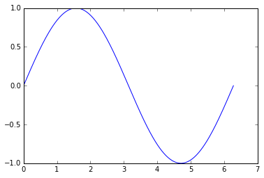
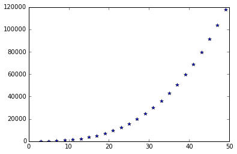
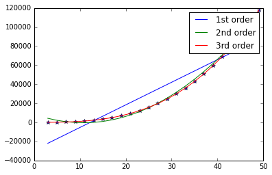

---
layout: page
title: "Workshop 4"
use_math: true
--- 
# Introduction to Numpy

By the end of this workshop you should be able to:

* define and generate NumPy arrays.
* carry out calculations using arrays.
* solve basic linear algebra problems using NumPy.
* fit polynomial equations to data.
 
 
## We start by... 
 
...starting the Jupyter notebook, creating a new notebook on the "Desktop"
folder and renaming the new notebook **Workshop 4**.

Then we initialise all the libraries needed by typing and executing the
following lines of code: 

**In [1]:**


%pylab inline
from matplotlib import *


    Populating the interactive namespace from numpy and matplotlib
    
 
## What is NumPy?
The NumPy module is used in almost all numerical computation using Python. It is
a package that provides high-performance vector, matrix and higher-dimensional
data structures for Python. NumPy is implemented in C and Fortran and therefore
performance is very good (=fast calculations).
NumPy is not included in the standard Python installation and it has to be
installed separately. The version of Python/Jupyter that we are using already
includes NumPy and the module is loaded when we load matplotlib, so we can use
its functionalities straight away. 
 
## Arrays 
 
NumPy introduces a new data type, the homogeneous multi-dimensional array.
Arrays are very similar to lists, but they are homogeneous, as all the elements
have to be of the same type (usually all integer, floating point real numbers or
complex numbers).

Arrays can be created in many ways. For example we can convert another data
type, such as a list, into an array using the **array()** function. Let's define
a list, as shown in the code below, and let's convert it into an array. Then
let's visualise both of them using the **print** statement. 

**In [2]:**


a_list = [2.0, 4.6]
an_array = array(a_list)

print a_list
print an_array


    [2.0, 4.6]
    [ 2.   4.6]
    
 
The 2 objects look very similar, the main difference being that the items in the
list are separated by commas.

We can also define multi-dimensional arrays in the same way. Type and execute
the following example, which generates a 2-dimensional array (a matrix, if you
prefer) and prints it to screen. 

**In [3]:**


a_2d_array =  array([[1,2],[4,5]])

print a_2d_array


    [[1 2]
     [4 5]]
    
 
The output shows the data neatly represented in rows and columns.

If we want to generate large arrays or matrices, NumPy offers several functions
that simplify and speed up the process. Here are some examples.

We can create an array containing a range of values using **arange(start, stop,
step)** (just like **range** creates a list ([Workshop 2](workshop-2)), **arange** creates an
array). Copy and test the following code, which creates 2 arrays and prints them
to screen: 

**In [4]:**


x = arange(0, 10)
y = arange(-1, 1, 0.1)
print x
print y


    [0 1 2 3 4 5 6 7 8 9]
    [ -1.00000000e+00  -9.00000000e-01  -8.00000000e-01  -7.00000000e-01
      -6.00000000e-01  -5.00000000e-01  -4.00000000e-01  -3.00000000e-01
      -2.00000000e-01  -1.00000000e-01  -2.22044605e-16   1.00000000e-01
       2.00000000e-01   3.00000000e-01   4.00000000e-01   5.00000000e-01
       6.00000000e-01   7.00000000e-01   8.00000000e-01   9.00000000e-01]
    
 
We can create an array of evenly spaced numbers over a specified interval using
**linspace(start,stop,number_of_elements)**.The default number of elements is
50. Once more, type and run the following code, which generates 2 arrays of
evenly spaced numbers: 

**In [5]:**


a = linspace(0,10)
print a
b = linspace(-1, 1, 5)
print b


    [  0.           0.20408163   0.40816327   0.6122449    0.81632653
       1.02040816   1.2244898    1.42857143   1.63265306   1.83673469
       2.04081633   2.24489796   2.44897959   2.65306122   2.85714286
       3.06122449   3.26530612   3.46938776   3.67346939   3.87755102
       4.08163265   4.28571429   4.48979592   4.69387755   4.89795918
       5.10204082   5.30612245   5.51020408   5.71428571   5.91836735
       6.12244898   6.32653061   6.53061224   6.73469388   6.93877551
       7.14285714   7.34693878   7.55102041   7.75510204   7.95918367
       8.16326531   8.36734694   8.57142857   8.7755102    8.97959184
       9.18367347   9.3877551    9.59183673   9.79591837  10.        ]
    [-1.  -0.5  0.   0.5  1. ]
    
 
It is also possible to generate matrices using NumPy functions.

* zeros(shape) generates a matrix of a given shape made up of zeros
* ones(shape) generates a matrix of a given shape made up of ones
* identity(size) generates an identity matrix (a square matrix with ones on the
main diagonal and zeros elsewhere) of a given size

Test these functions out with the following code. 

**In [6]:**


zero_mat = zeros((3, 4)) # 3 is the number of rows, 4 is the number of columns of the matrix
one_mat = ones((5,5))
I_mat=identity(5)

print zero_mat
print one_mat
print I_mat


    [[ 0.  0.  0.  0.]
     [ 0.  0.  0.  0.]
     [ 0.  0.  0.  0.]]
    [[ 1.  1.  1.  1.  1.]
     [ 1.  1.  1.  1.  1.]
     [ 1.  1.  1.  1.  1.]
     [ 1.  1.  1.  1.  1.]
     [ 1.  1.  1.  1.  1.]]
    [[ 1.  0.  0.  0.  0.]
     [ 0.  1.  0.  0.  0.]
     [ 0.  0.  1.  0.  0.]
     [ 0.  0.  0.  1.  0.]
     [ 0.  0.  0.  0.  1.]]
    
 
Items in arrays are indexed, just as they are in lists. All that was previously
discussed about indexes and lists, applies also to arrays. If the array is
n-dimensional, we'll need n indices to identify an element.
The following example prints out 2 elements of the matrix I that was defined
previously. 

**In [7]:**


print I_mat[2,2]
print I_mat[3,2]


    1.0
    0.0
    
 
So why do we bother with arrays when we already have lists?
Arrays are much more powerful objects: many mathematical functions can accept an
array as an argument (but they cannot accept a list) and there are many
functions that have been included in the NumPy module that allow for the
creation and manipulation of arrays in a way that would not be possible with
lists.

Here's an example. If we wanted to carry out the same mathematical operation on
each item of a list, we would need to create a new list where we can save the
results, and we would need a loop which iterates through the items of the
initial list,  carry out the calculations and append the results to the list of
results. We can cut this cumbersome list of operation down considerably using
arrays.
Copy and run the following example: 

**In [8]:**


a = array([1.0,2.0,3.0,4.0])
b = 1/a
print b


    [ 1.          0.5         0.33333333  0.25      ]
    
 
During [Workshop 2](workshop-2) we plotted the graph of the $y=\sin(x)$ function using lists.
This required the use of a loop and the **append()** function. Once more, this
can be cut short with the use of arrays, as seen in the following example, which
you should copy and execute. 

**In [9]:**


x = linspace(0, 2*pi, 200)
plot(x,sin(x))


    [<matplotlib.lines.Line2D at 0xa45b0f0>]

 
 

 
## Operations with matrices 
 
Matrices are 2-dimensional arrays.
If you want more basic information about matrices and linear algebra, please
refer to the Monk and Munro, *Maths for Chemistry* book.

With NumPy we can easily carry out operations with matrices, such as the dot
product between 2 matrices.

**IMPORTANT:** the number of columns in the first matrix must be the same as the
number of rows in the second matrix
if A is a (m,n) matrix and B is a (n,p) matrix, the result of **dot(A, B)** is a
(m,p) matrix.

Let's create 2 matrices, A and B, and let's calculate the dot product and assign
the result to another matrix C. Type and run the following code: 

**In [10]:**


A = array([[1,2],[3,4],[-1,0],[3,1]])
B = array([[1,3,1], [2, -1,0]])
C = dot(A, B)
print(C)


    [[ 5  1  1]
     [11  5  3]
     [-1 -3 -1]
     [ 5  8  3]]
    
 
Other matrix operations that are usually very time consuming can be carried out
with one line of code using the correct NumPy function. For example, we can
calculate the transpose of a matrix, its inverse and its determinant. Type and
run this code in your notebook. 

**In [11]:**


A = array([[5,2,3], [4, 7,1],[8,5,9]])
B = A.transpose() ##transpose of matrix a
C = inv(A) #inverse of matrix a
d = det(A) #determinant of matrix a
print B
print C
print d


    [[5 4 8]
     [2 7 5]
     [3 1 9]]
    [[ 0.46031746 -0.02380952 -0.15079365]
     [-0.22222222  0.16666667  0.05555556]
     [-0.28571429 -0.07142857  0.21428571]]
    126.0
    
 
Linear algebra is very useful for the solution of systems of linear equations.
While the following example could easily be solved using pen and paper, the
solution of systems of linear equations with larger numbers of unknowns is
often a very time-consuming operation.

x + y + z = 6

2y + 5z = -4

2x + 5y - z = 27

First we have to create the matrix **A** of the coefficients for $x$, $y$ and
$z$. In this case this is a 3x3 matrix. We also have to define an array **b**
containing the constant terms. The system of linear equations can be solved
using the **solve(A,b)** function.
Type and run the example: 

**In [12]:**


A=array([[1,1,1], # first equation
        [0,2,5],  # second equation
        [2,5,-1]])# third equation
b=array([6,-4,27])
print solve(A,b)


    [ 5.  3. -2.]
    
 
## Polynomial fitting
 
 
A polynomial is a mathematical expression involving a sum of (positive) powers
in one or more variables multiplied by coefficients. A polynomial in one
variable $x$ with constant coefficients is given by

$a_n x^n + a_{n-1}x^{n-1} + ... +\ a_2 x^2 + a_1x+a_0$

$n$, the highest power of the variable is called the *order* of the polynomial
and $a_n ...a_0$ are the coefficients of the polynomial.

Polynomial equations are often used in all Sciences to fit experimental data and
model observable phenomena.
In this example we will use the NumPy function **polyfit()** to do polynomial
fitting of a set of experimental data contained in a datafile.

First of all, download the [workshop4_1.txt](./examples/workshop4_1.txt) file, by right-clicking on the link and saving the file in the Desktop
folder. This file contains a series of numerical data in rows and columns. We
want to be able to read the data file line by line and we would like to split
the content of each line into 2 numerical x and y values. We want to convert the
x and y values to arrays and plot the graph for the data contained in the file.
This can be achieved using the code in the following cell: 

**In [13]:**


f=open('workshop4-1.txt','r')
x=[]
y=[]
for aLine in f: 
    s=aLine.split(',')
    x.append(float(s[0])) 
    y.append(float(s[1]))
x_data=array(x)
y_data=array(y)
plot(x_data,y_data, "b*")


    [<matplotlib.lines.Line2D at 0xa71da20>]

 
 

 
The polynomial fitting can then be done using the **polyfit(x_data,y_data,n)**
function, where **n** is the order of the polynomial. This returns an array
containing the parameters of the best possible polynomial fit of order **n**.

Let's try to fit 3 different polynomials of order 1, 2 and 3.
Copy and run the following code: 

**In [14]:**


params1 = polyfit(x_data,y_data,1)
print params1
params2 = polyfit(x_data,y_data,2)
print params2
params3 = polyfit(x_data,y_data,3)
print params3



    [  2372.         -29107.76666667]
    [   77.9 -1678.8  8621.8]
    [ 1.  -0.1  5.  -5. ]
    
 
We now want to verify how good these fitting equations are to our experimental
data. First we create the values of $y$ for the 3 polynomials of order 1, 2 and
3, according to the polynomial equation:

$a_n x^n + a_{n-1}x^{n-1} + ... +\ a_2 x^2 + a_1x+a_0$

Then we can plot them against the data read from the datafile.
Copy and run the following code. You can see that the 3rd order polynomial fits
the data perfectly.

A more precise estimate of the fit is the $R^2$ which could easily be calculated
(and it would be 1 in the case of the 3rd order polynomial). 

**In [15]:**


y1 = params1[0]*x_data + params1[1]  # polynomial of order 1
y2 = params2[0]*x_data**2 + params2[1]*x_data + params2[2] # polynomial of order 2
y3 = params3[0]*x_data**3 + params3[1]*x_data**2 + params3[2]*x_data + params3[3]  # polynomial of order 3

plot(x_data,y_data,"b*")
plot(x_data,y1,label = "1st order")
plot(x_data,y2, label = "2nd order")
plot(x_data,y3,label = "3rd order")
plt.legend()


 
 

 
## Application 
 
A property of matrix multiplication is that, if $A$ is a $m\times n$ matrix, then

$I_{m}\, A=A\, I_{n}=A$

where $I_{m}$ and $I_{n}$ are the $m\times m\ $  and $n\times n\ $  identity matrices.

Generate (3,3) and (5,5) identity matrices and print them to screen.

Create a program to generate a matrix A of shape (3,5) and to show that this property is true.
