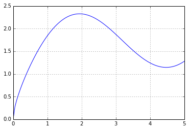

---
layout: page
title: "Workshop 5"
use_math: true
--- 
# Introduction to SciPy and Pandas

By the end of this workshop you should be able to:
* use the SciPy libraries to fit a curve to a set of experimental data.
* find the minima and maxima of a function.
* find the solutions of a function.
* read lists within a data file in table format.
* carry out and plot a simple linear regression analysis using pandas. 
 
## First...
...start the Jupyter notebook, create a new notebook in the "Desktop" folder and
rename the new notebook **Workshop 5**.

Then we initialise all the libraries needed by typing and executing the
following lines of code: 

**In [1]:**


%pylab inline
from matplotlib import *


    Populating the interactive namespace from numpy and matplotlib
    
 
# SciPy

SciPy is a collection of libraries for mathematics, science, and engineering.
More information on SciPy can be found
[here](http://docs.scipy.org/doc/scipy/reference/).

In this part of the workshop we will make use of **optimize**, one of the many
SciPy libraries. So first of all, we will import it with the following code: 

**In [2]:**


from scipy import optimize

 
## Curve fitting
During [Workshop 4](workshop-4), we saw how we can fit polynomial curves to data using
the **polyfit** method found in **NumPy**.
However, there are situations when a polynomial curve is not the ideal choice.
Let's show this with an example. First of all, download the [workshop5_1.txt](./examples/workshop5_1.txt) file and save it in the Desktop folder. As we have done in previous
workshops, let's open the file, read the data and display it. 

**In [3]:**


f=open('workshop5_1.txt','r')
x=[]
y=[]
for aLine in f: 
    s=aLine.split(',')
    x.append(float(s[0])) 
    y.append(float(s[1]))
x_data=array(x)
y_data=array(y)
plot(x_data,y_data, "ro")


    [<matplotlib.lines.Line2D at 0xa7db1d0>]

 
 

 
This sort of "bell-shaped" curve is usually typical of a **gaussian**
distribution. The equation of a gaussian distribution is:

$ y = A \exp(bx^2)$

where *A* and *b* are 2 fitting parameters. We can attempt to find the values of
*A* and *b* that give us the best fit between a gaussian function and the
experimental data obtained from the data file.
So in the following code we define the gaussian function. Then we use the
**optimize.curve_fit()** method to fit the function. The best fit values of *A*
and *b* are places in the array params: *A* in params[0] and *b* in params[1].
Finally we can plot the fit and the experimental data for values of *x* between
-1 and 1. 

**In [4]:**


def gauss(x,A,b):
    return A*exp(b*x**2)

params,conv = optimize.curve_fit(gauss,x_data,y_data)
print params
x_fit = linspace(-1,1)
y_fit = gauss(x_fit,params[0],params[1])
plot(x_data,y_data,'ro')
plot(x_fit,y_fit)



    [ 29.61755071 -10.04316111]
    [<matplotlib.lines.Line2D at 0xa69df98>]

 
 

 
## Finding minima (or maxima) of a function

More information on this can be found [here](http://scipy-
lectures.github.io/advanced/mathematical_optimization/index.html)

Again, it is easier to see this in action with an example. Let's define the
function:

$ y=\sin{x}+\sqrt{x}$

and let's plot it for x values going from 0 to +5 

**In [5]:**


def f(x):
    return sin(x) + sqrt(x)

x = linspace(0, 5, 100)
grid(True)
plot(x, f(x))


    [<matplotlib.lines.Line2D at 0xa7131d0>]

 
 

 
By looking at the plot, we can see that the function has 1 minimum located
between 4 and 5. In order to find the analytical solutions to this function we
can use the **optimize.fmin()** method. This method takes 2 arguments: the
function that we need to find a minimum for, and an initial guess of what the
minimum may be. Let's try this method giving it an initial guess of 4. 

**In [6]:**


x_min = optimize.fmin(f,4)
print x_min, f(x_min)


    Optimization terminated successfully.
             Current function value: 1.143464
             Iterations: 13
             Function evaluations: 26
    [ 4.47373047] [ 1.14346352]
    
 
The function also has a maximum around 2. However, SciPy does not offer a method
to identify the maximum of a function. What we can do is define a new function
that returns the negative of f(x), and calculate its minimum with
**optimize.fmin()**, with an initial guess of 2. 

**In [7]:**


def negf(x):
    return -f(x)
x_max = optimize.fmin(negf,2)
print x_max, f(x_max)


    Optimization terminated successfully.
             Current function value: -2.325456
             Iterations: 12
             Function evaluations: 24
    [ 1.93818359] [ 2.32545559]
    
 
## Finding the solution(s) of a function
Let's define the function:

$ y=x^2 +1.5x-30$

and let's plot it for x values going from -7 to +7 

**In [8]:**


def f(x):
    return  x**2 + 1.5*x - 30

x = linspace(-7, 7, 100)
grid(True)
plot(x, f(x))


    [<matplotlib.lines.Line2D at 0x13fd2048>]

 
 

 
By looking at the plot, we can see that the function has 2 solutions: one around
-6 and the other around 5. In order to find the analytical solutions to this
function we can use the **optimize.fsolve()** method. This method takes 2
arguments: the function that we need to find solutions for, and an initial guess
of what the solution may be. Let's try this method giving it an initial guess of
-6. 

**In [9]:**


optimize.fsolve(f,-6)


    array([-6.2783361])

 
Alternatively, if we want to find the solution close to the value of 5, we can
simply change the initial guess, as seen in the code below. 

**In [10]:**


optimize.fsolve(f, 5)


    array([ 4.7783361])

 
# Pandas 
 
Pandas is a Python library providing high-performance, easy-to-use data
structures and data analysis tools.

In order to use pandas we need to import some of the relevant libraries, as
shown below: 

**In [11]:**


import pandas as pd
from pandas import DataFrame, Series

 
So far, if we want to open a data file [water_quality.csv](./examples/water_quality.csv) and ask
python to simply print the data, we have to know a bit about the file we're
reading, and do a bit of coding.

We would also need to do a little bit of coding to get rid of the strings within
lists before we could do anything with them, and the visual list of values,
especially when mulitple lists are involved, is not always quick and easy. For
example, empty entries within the list appear as ' ', which are sometimes missed
amongst all the other entries and punctuation. 

**In [12]:**


data = open('water_quality.csv', 'r')
Year = []
Ammonia = []
Dissolved_oxygen = []
Nitrates = []
Phosphates = []

for aLine in data:
    s = aLine.split(',')
    Year.append(s[0])
    Ammonia.append(s[1])
    Dissolved_oxygen.append(s[2])
    Nitrates.append(s[3])
    Phosphates.append(s[4])
data.close()

print Year
print Ammonia
print Dissolved_oxygen
print Nitrates
print Phosphates


    ['Year', '2009', '2008', '2007', '2006', '2005', '2004', '2003', '2002', '2001', '2000', '1999', '1998', '1997', '1996', '1995', '1994', '1993', '1992', '1991', '1990']
    ['Ammonia', '0.078', '0.099', '0.095', '0.087', '0.093', '0.085', '0.071', '0.067', '0.083', '0.075', '0.068', '0.058', '0.058', '0.063', '0.075', '0.07', '0.077', '0.069', '0.075', '0.073']
    ['Dissolved_Oxygen', '89.32', '90.06', '', '91.25', '', '92.1', '93.15', '93.86', '', '94.02', '94.34', '94.636', '94.77', '95.476', '', '95.58', '96.42', '96.91', '97.23', '97.56']
    ['Nitrates', '9.561', '9.356', '8.664', '8.234', '8.765', '7.961', '7.564', '8.315', '8.003', '7.861', '7.465', '6.964', '6.549', '5.912', '5.531', '5.342', '5.315', '5.002', '4.986', '4.756']
    ['Phosphates\n', '0.09\n', '0.086\n', '0.091\n', '0.082\n', '0.079\n', '0.076\n', '0.072\n', '0.065\n', '0.068\n', '0.064\n', '0.062\n', '0.059\n', '0.056\n', '0.05\n', '0.046\n', '0.044\n', '0.04\n', '0.038\n', '0.035\n', '0.032\n']
    
 
Pandas let us visualise data differently within python. It's often easier to
make sense of multiple data lists if they're presented in table form, and empty
cells are indicated by 'NaN' (not a number). 

**In [13]:**


data = pd.read_csv('water_quality.csv')
data


<table border="1" class="dataframe">
  <thead>
    <tr style="text-align: right;">
      <th></th>
      <th>Year</th>
      <th>Ammonia</th>
      <th>Dissolved_Oxygen</th>
      <th>Nitrates</th>
      <th>Phosphates</th>
    </tr>
  </thead>
  <tbody>
    <tr>
      <th>0 </th>
      <td> 2009</td>
      <td> 0.078</td>
      <td> 89.320</td>
      <td> 9.561</td>
      <td> 0.090</td>
    </tr>
    <tr>
      <th>1 </th>
      <td> 2008</td>
      <td> 0.099</td>
      <td> 90.060</td>
      <td> 9.356</td>
      <td> 0.086</td>
    </tr>
    <tr>
      <th>2 </th>
      <td> 2007</td>
      <td> 0.095</td>
      <td>    NaN</td>
      <td> 8.664</td>
      <td> 0.091</td>
    </tr>
    <tr>
      <th>3 </th>
      <td> 2006</td>
      <td> 0.087</td>
      <td> 91.250</td>
      <td> 8.234</td>
      <td> 0.082</td>
    </tr>
    <tr>
      <th>4 </th>
      <td> 2005</td>
      <td> 0.093</td>
      <td>    NaN</td>
      <td> 8.765</td>
      <td> 0.079</td>
    </tr>
    <tr>
      <th>5 </th>
      <td> 2004</td>
      <td> 0.085</td>
      <td> 92.100</td>
      <td> 7.961</td>
      <td> 0.076</td>
    </tr>
    <tr>
      <th>6 </th>
      <td> 2003</td>
      <td> 0.071</td>
      <td> 93.150</td>
      <td> 7.564</td>
      <td> 0.072</td>
    </tr>
    <tr>
      <th>7 </th>
      <td> 2002</td>
      <td> 0.067</td>
      <td> 93.860</td>
      <td> 8.315</td>
      <td> 0.065</td>
    </tr>
    <tr>
      <th>8 </th>
      <td> 2001</td>
      <td> 0.083</td>
      <td>    NaN</td>
      <td> 8.003</td>
      <td> 0.068</td>
    </tr>
    <tr>
      <th>9 </th>
      <td> 2000</td>
      <td> 0.075</td>
      <td> 94.020</td>
      <td> 7.861</td>
      <td> 0.064</td>
    </tr>
    <tr>
      <th>10</th>
      <td> 1999</td>
      <td> 0.068</td>
      <td> 94.340</td>
      <td> 7.465</td>
      <td> 0.062</td>
    </tr>
    <tr>
      <th>11</th>
      <td> 1998</td>
      <td> 0.058</td>
      <td> 94.636</td>
      <td> 6.964</td>
      <td> 0.059</td>
    </tr>
    <tr>
      <th>12</th>
      <td> 1997</td>
      <td> 0.058</td>
      <td> 94.770</td>
      <td> 6.549</td>
      <td> 0.056</td>
    </tr>
    <tr>
      <th>13</th>
      <td> 1996</td>
      <td> 0.063</td>
      <td> 95.476</td>
      <td> 5.912</td>
      <td> 0.050</td>
    </tr>
    <tr>
      <th>14</th>
      <td> 1995</td>
      <td> 0.075</td>
      <td>    NaN</td>
      <td> 5.531</td>
      <td> 0.046</td>
    </tr>
    <tr>
      <th>15</th>
      <td> 1994</td>
      <td> 0.070</td>
      <td> 95.580</td>
      <td> 5.342</td>
      <td> 0.044</td>
    </tr>
    <tr>
      <th>16</th>
      <td> 1993</td>
      <td> 0.077</td>
      <td> 96.420</td>
      <td> 5.315</td>
      <td> 0.040</td>
    </tr>
    <tr>
      <th>17</th>
      <td> 1992</td>
      <td> 0.069</td>
      <td> 96.910</td>
      <td> 5.002</td>
      <td> 0.038</td>
    </tr>
    <tr>
      <th>18</th>
      <td> 1991</td>
      <td> 0.075</td>
      <td> 97.230</td>
      <td> 4.986</td>
      <td> 0.035</td>
    </tr>
    <tr>
      <th>19</th>
      <td> 1990</td>
      <td> 0.073</td>
      <td> 97.560</td>
      <td> 4.756</td>
      <td> 0.032</td>
    </tr>
  </tbody>
</table>

 
Pandas also let us easily manipulate the tables. We can look at one column on
its own using a feature called indexing: 

**In [14]:**


data.ix[:,['Dissolved_Oxygen']]


<table border="1" class="dataframe">
  <thead>
    <tr style="text-align: right;">
      <th></th>
      <th>Dissolved_Oxygen</th>
    </tr>
  </thead>
  <tbody>
    <tr>
      <th>0 </th>
      <td> 89.320</td>
    </tr>
    <tr>
      <th>1 </th>
      <td> 90.060</td>
    </tr>
    <tr>
      <th>2 </th>
      <td>    NaN</td>
    </tr>
    <tr>
      <th>3 </th>
      <td> 91.250</td>
    </tr>
    <tr>
      <th>4 </th>
      <td>    NaN</td>
    </tr>
    <tr>
      <th>5 </th>
      <td> 92.100</td>
    </tr>
    <tr>
      <th>6 </th>
      <td> 93.150</td>
    </tr>
    <tr>
      <th>7 </th>
      <td> 93.860</td>
    </tr>
    <tr>
      <th>8 </th>
      <td>    NaN</td>
    </tr>
    <tr>
      <th>9 </th>
      <td> 94.020</td>
    </tr>
    <tr>
      <th>10</th>
      <td> 94.340</td>
    </tr>
    <tr>
      <th>11</th>
      <td> 94.636</td>
    </tr>
    <tr>
      <th>12</th>
      <td> 94.770</td>
    </tr>
    <tr>
      <th>13</th>
      <td> 95.476</td>
    </tr>
    <tr>
      <th>14</th>
      <td>    NaN</td>
    </tr>
    <tr>
      <th>15</th>
      <td> 95.580</td>
    </tr>
    <tr>
      <th>16</th>
      <td> 96.420</td>
    </tr>
    <tr>
      <th>17</th>
      <td> 96.910</td>
    </tr>
    <tr>
      <th>18</th>
      <td> 97.230</td>
    </tr>
    <tr>
      <th>19</th>
      <td> 97.560</td>
    </tr>
  </tbody>
</table>

 
And we can look at certain subsets of the data, for example all of the data
corresponding to phosphate levels > 0.045. 

**In [15]:**


data.ix[data['Phosphates'] > 0.045]


<table border="1" class="dataframe">
  <thead>
    <tr style="text-align: right;">
      <th></th>
      <th>Year</th>
      <th>Ammonia</th>
      <th>Dissolved_Oxygen</th>
      <th>Nitrates</th>
      <th>Phosphates</th>
    </tr>
  </thead>
  <tbody>
    <tr>
      <th>0 </th>
      <td> 2009</td>
      <td> 0.078</td>
      <td> 89.320</td>
      <td> 9.561</td>
      <td> 0.090</td>
    </tr>
    <tr>
      <th>1 </th>
      <td> 2008</td>
      <td> 0.099</td>
      <td> 90.060</td>
      <td> 9.356</td>
      <td> 0.086</td>
    </tr>
    <tr>
      <th>2 </th>
      <td> 2007</td>
      <td> 0.095</td>
      <td>    NaN</td>
      <td> 8.664</td>
      <td> 0.091</td>
    </tr>
    <tr>
      <th>3 </th>
      <td> 2006</td>
      <td> 0.087</td>
      <td> 91.250</td>
      <td> 8.234</td>
      <td> 0.082</td>
    </tr>
    <tr>
      <th>4 </th>
      <td> 2005</td>
      <td> 0.093</td>
      <td>    NaN</td>
      <td> 8.765</td>
      <td> 0.079</td>
    </tr>
    <tr>
      <th>5 </th>
      <td> 2004</td>
      <td> 0.085</td>
      <td> 92.100</td>
      <td> 7.961</td>
      <td> 0.076</td>
    </tr>
    <tr>
      <th>6 </th>
      <td> 2003</td>
      <td> 0.071</td>
      <td> 93.150</td>
      <td> 7.564</td>
      <td> 0.072</td>
    </tr>
    <tr>
      <th>7 </th>
      <td> 2002</td>
      <td> 0.067</td>
      <td> 93.860</td>
      <td> 8.315</td>
      <td> 0.065</td>
    </tr>
    <tr>
      <th>8 </th>
      <td> 2001</td>
      <td> 0.083</td>
      <td>    NaN</td>
      <td> 8.003</td>
      <td> 0.068</td>
    </tr>
    <tr>
      <th>9 </th>
      <td> 2000</td>
      <td> 0.075</td>
      <td> 94.020</td>
      <td> 7.861</td>
      <td> 0.064</td>
    </tr>
    <tr>
      <th>10</th>
      <td> 1999</td>
      <td> 0.068</td>
      <td> 94.340</td>
      <td> 7.465</td>
      <td> 0.062</td>
    </tr>
    <tr>
      <th>11</th>
      <td> 1998</td>
      <td> 0.058</td>
      <td> 94.636</td>
      <td> 6.964</td>
      <td> 0.059</td>
    </tr>
    <tr>
      <th>12</th>
      <td> 1997</td>
      <td> 0.058</td>
      <td> 94.770</td>
      <td> 6.549</td>
      <td> 0.056</td>
    </tr>
    <tr>
      <th>13</th>
      <td> 1996</td>
      <td> 0.063</td>
      <td> 95.476</td>
      <td> 5.912</td>
      <td> 0.050</td>
    </tr>
    <tr>
      <th>14</th>
      <td> 1995</td>
      <td> 0.075</td>
      <td>    NaN</td>
      <td> 5.531</td>
      <td> 0.046</td>
    </tr>
  </tbody>
</table>

 
We can use boolean operators to create additional subsets: 

**In [16]:**


data.ix[(data['Ammonia'] > 0.06) & (data['Ammonia'] < 0.07)]


<table border="1" class="dataframe">
  <thead>
    <tr style="text-align: right;">
      <th></th>
      <th>Year</th>
      <th>Ammonia</th>
      <th>Dissolved_Oxygen</th>
      <th>Nitrates</th>
      <th>Phosphates</th>
    </tr>
  </thead>
  <tbody>
    <tr>
      <th>7 </th>
      <td> 2002</td>
      <td> 0.067</td>
      <td> 93.860</td>
      <td> 8.315</td>
      <td> 0.065</td>
    </tr>
    <tr>
      <th>10</th>
      <td> 1999</td>
      <td> 0.068</td>
      <td> 94.340</td>
      <td> 7.465</td>
      <td> 0.062</td>
    </tr>
    <tr>
      <th>13</th>
      <td> 1996</td>
      <td> 0.063</td>
      <td> 95.476</td>
      <td> 5.912</td>
      <td> 0.050</td>
    </tr>
    <tr>
      <th>17</th>
      <td> 1992</td>
      <td> 0.069</td>
      <td> 96.910</td>
      <td> 5.002</td>
      <td> 0.038</td>
    </tr>
  </tbody>
</table>

 
We can rename columns: 

**In [17]:**


data2 = data.rename(columns = {'Year': 'Sampling Time'})
data2


<table border="1" class="dataframe">
  <thead>
    <tr style="text-align: right;">
      <th></th>
      <th>Sampling Time</th>
      <th>Ammonia</th>
      <th>Dissolved_Oxygen</th>
      <th>Nitrates</th>
      <th>Phosphates</th>
    </tr>
  </thead>
  <tbody>
    <tr>
      <th>0 </th>
      <td> 2009</td>
      <td> 0.078</td>
      <td> 89.320</td>
      <td> 9.561</td>
      <td> 0.090</td>
    </tr>
    <tr>
      <th>1 </th>
      <td> 2008</td>
      <td> 0.099</td>
      <td> 90.060</td>
      <td> 9.356</td>
      <td> 0.086</td>
    </tr>
    <tr>
      <th>2 </th>
      <td> 2007</td>
      <td> 0.095</td>
      <td>    NaN</td>
      <td> 8.664</td>
      <td> 0.091</td>
    </tr>
    <tr>
      <th>3 </th>
      <td> 2006</td>
      <td> 0.087</td>
      <td> 91.250</td>
      <td> 8.234</td>
      <td> 0.082</td>
    </tr>
    <tr>
      <th>4 </th>
      <td> 2005</td>
      <td> 0.093</td>
      <td>    NaN</td>
      <td> 8.765</td>
      <td> 0.079</td>
    </tr>
    <tr>
      <th>5 </th>
      <td> 2004</td>
      <td> 0.085</td>
      <td> 92.100</td>
      <td> 7.961</td>
      <td> 0.076</td>
    </tr>
    <tr>
      <th>6 </th>
      <td> 2003</td>
      <td> 0.071</td>
      <td> 93.150</td>
      <td> 7.564</td>
      <td> 0.072</td>
    </tr>
    <tr>
      <th>7 </th>
      <td> 2002</td>
      <td> 0.067</td>
      <td> 93.860</td>
      <td> 8.315</td>
      <td> 0.065</td>
    </tr>
    <tr>
      <th>8 </th>
      <td> 2001</td>
      <td> 0.083</td>
      <td>    NaN</td>
      <td> 8.003</td>
      <td> 0.068</td>
    </tr>
    <tr>
      <th>9 </th>
      <td> 2000</td>
      <td> 0.075</td>
      <td> 94.020</td>
      <td> 7.861</td>
      <td> 0.064</td>
    </tr>
    <tr>
      <th>10</th>
      <td> 1999</td>
      <td> 0.068</td>
      <td> 94.340</td>
      <td> 7.465</td>
      <td> 0.062</td>
    </tr>
    <tr>
      <th>11</th>
      <td> 1998</td>
      <td> 0.058</td>
      <td> 94.636</td>
      <td> 6.964</td>
      <td> 0.059</td>
    </tr>
    <tr>
      <th>12</th>
      <td> 1997</td>
      <td> 0.058</td>
      <td> 94.770</td>
      <td> 6.549</td>
      <td> 0.056</td>
    </tr>
    <tr>
      <th>13</th>
      <td> 1996</td>
      <td> 0.063</td>
      <td> 95.476</td>
      <td> 5.912</td>
      <td> 0.050</td>
    </tr>
    <tr>
      <th>14</th>
      <td> 1995</td>
      <td> 0.075</td>
      <td>    NaN</td>
      <td> 5.531</td>
      <td> 0.046</td>
    </tr>
    <tr>
      <th>15</th>
      <td> 1994</td>
      <td> 0.070</td>
      <td> 95.580</td>
      <td> 5.342</td>
      <td> 0.044</td>
    </tr>
    <tr>
      <th>16</th>
      <td> 1993</td>
      <td> 0.077</td>
      <td> 96.420</td>
      <td> 5.315</td>
      <td> 0.040</td>
    </tr>
    <tr>
      <th>17</th>
      <td> 1992</td>
      <td> 0.069</td>
      <td> 96.910</td>
      <td> 5.002</td>
      <td> 0.038</td>
    </tr>
    <tr>
      <th>18</th>
      <td> 1991</td>
      <td> 0.075</td>
      <td> 97.230</td>
      <td> 4.986</td>
      <td> 0.035</td>
    </tr>
    <tr>
      <th>19</th>
      <td> 1990</td>
      <td> 0.073</td>
      <td> 97.560</td>
      <td> 4.756</td>
      <td> 0.032</td>
    </tr>
  </tbody>
</table>

 
And we can tell the computer to ignore lines where there are empty cells: 

**In [18]:**


data2.dropna()


<table border="1" class="dataframe">
  <thead>
    <tr style="text-align: right;">
      <th></th>
      <th>Sampling Time</th>
      <th>Ammonia</th>
      <th>Dissolved_Oxygen</th>
      <th>Nitrates</th>
      <th>Phosphates</th>
    </tr>
  </thead>
  <tbody>
    <tr>
      <th>0 </th>
      <td> 2009</td>
      <td> 0.078</td>
      <td> 89.320</td>
      <td> 9.561</td>
      <td> 0.090</td>
    </tr>
    <tr>
      <th>1 </th>
      <td> 2008</td>
      <td> 0.099</td>
      <td> 90.060</td>
      <td> 9.356</td>
      <td> 0.086</td>
    </tr>
    <tr>
      <th>3 </th>
      <td> 2006</td>
      <td> 0.087</td>
      <td> 91.250</td>
      <td> 8.234</td>
      <td> 0.082</td>
    </tr>
    <tr>
      <th>5 </th>
      <td> 2004</td>
      <td> 0.085</td>
      <td> 92.100</td>
      <td> 7.961</td>
      <td> 0.076</td>
    </tr>
    <tr>
      <th>6 </th>
      <td> 2003</td>
      <td> 0.071</td>
      <td> 93.150</td>
      <td> 7.564</td>
      <td> 0.072</td>
    </tr>
    <tr>
      <th>7 </th>
      <td> 2002</td>
      <td> 0.067</td>
      <td> 93.860</td>
      <td> 8.315</td>
      <td> 0.065</td>
    </tr>
    <tr>
      <th>9 </th>
      <td> 2000</td>
      <td> 0.075</td>
      <td> 94.020</td>
      <td> 7.861</td>
      <td> 0.064</td>
    </tr>
    <tr>
      <th>10</th>
      <td> 1999</td>
      <td> 0.068</td>
      <td> 94.340</td>
      <td> 7.465</td>
      <td> 0.062</td>
    </tr>
    <tr>
      <th>11</th>
      <td> 1998</td>
      <td> 0.058</td>
      <td> 94.636</td>
      <td> 6.964</td>
      <td> 0.059</td>
    </tr>
    <tr>
      <th>12</th>
      <td> 1997</td>
      <td> 0.058</td>
      <td> 94.770</td>
      <td> 6.549</td>
      <td> 0.056</td>
    </tr>
    <tr>
      <th>13</th>
      <td> 1996</td>
      <td> 0.063</td>
      <td> 95.476</td>
      <td> 5.912</td>
      <td> 0.050</td>
    </tr>
    <tr>
      <th>15</th>
      <td> 1994</td>
      <td> 0.070</td>
      <td> 95.580</td>
      <td> 5.342</td>
      <td> 0.044</td>
    </tr>
    <tr>
      <th>16</th>
      <td> 1993</td>
      <td> 0.077</td>
      <td> 96.420</td>
      <td> 5.315</td>
      <td> 0.040</td>
    </tr>
    <tr>
      <th>17</th>
      <td> 1992</td>
      <td> 0.069</td>
      <td> 96.910</td>
      <td> 5.002</td>
      <td> 0.038</td>
    </tr>
    <tr>
      <th>18</th>
      <td> 1991</td>
      <td> 0.075</td>
      <td> 97.230</td>
      <td> 4.986</td>
      <td> 0.035</td>
    </tr>
    <tr>
      <th>19</th>
      <td> 1990</td>
      <td> 0.073</td>
      <td> 97.560</td>
      <td> 4.756</td>
      <td> 0.032</td>
    </tr>
  </tbody>
</table>

 
Pandas are also really useful for plotting and statistics. If we want to
visualise the data as scatterplots: 

**In [19]:**


data.plot(kind='scatter', x = 'Year', y = 'Ammonia')
data.plot(kind='scatter', x = 'Year', y = 'Dissolved_Oxygen')
data.plot(kind='scatter', x = 'Year', y = 'Nitrates')
data.plot(kind='scatter', x = 'Year', y = 'Phosphates')


    <matplotlib.axes._subplots.AxesSubplot at 0x15c3da20>

 
 

 
 

 
 

 
 

 
Let's say we are asked to create a model for water quality in this river over
time, and we are going to use this model to predict various chemical
concentrations in the future. Obviously the actual concentrations of ammonia,
dissolved oxygen, nitrates and phosphates will vary according to a number of
environmental factors (sampling season, fertiliser runoff, air pollution,
climate change, etc.), but we can create a very basic, first-approach model to
answer our question by assuming that all of these factors are constant over
time.

To do this with any kind of reliability we need to quantify the current trends
with time, which we can do through 'Ordinary Least Squares' (OLS) regression,
which will give us a linear trendline. If we tell python to directly compare
'Years' with 'Phosphates' using OLS, for example, it will calculate the slope
and intercept of the line based on the current data points. 

**In [20]:**


import statsmodels.formula.api as smf

lm = smf.ols(formula = 'Phosphates ~ Year', data = data).fit()
print lm.params


    Intercept   -6.241937
    Year         0.003153
    dtype: float64
    
 
Remembering that **y = mx + b**, we can then calculate predicted values at any
time point, based on the current parameters. So, for example, if we want to know
what phosphate concentration is likely to be in 2020: 

**In [21]:**


phosphates2020 = (0.003153*2020) - 6.241937
print phosphates2020


    0.127123
    
 
So in 2020, phosphate concentrations are likely to be around 0.13 mg/L, assuming
all factors remain constant.
We can also use pandas to do this calculation in table form (be careful though -
if there are any empty cells in your data column the predict function won't
work): 

**In [22]:**


phosphates2020 = pd.DataFrame({'Year':[2020]})
phosphates2020.head()


<table border="1" class="dataframe">
  <thead>
    <tr style="text-align: right;">
      <th></th>
      <th>Year</th>
    </tr>
  </thead>
  <tbody>
    <tr>
      <th>0</th>
      <td> 2020</td>
    </tr>
  </tbody>
</table>

**In [23]:**


lm.predict(phosphates2020)


    array([ 0.12637895])

 
To draw a regression line through the data, we need to know the maximum and
minimum values and then calculate the corresponding phosphate values for those
years. 

**In [24]:**


phosphates2020 = pd.DataFrame({'Year':[data.Year.min(), data.Year.max()]})
phosphates2020.head()


<table border="1" class="dataframe">
  <thead>
    <tr style="text-align: right;">
      <th></th>
      <th>Year</th>
    </tr>
  </thead>
  <tbody>
    <tr>
      <th>0</th>
      <td> 1990</td>
    </tr>
    <tr>
      <th>1</th>
      <td> 2009</td>
    </tr>
  </tbody>
</table>

**In [25]:**


predictions = lm.predict(phosphates2020)
predictions


    array([ 0.0318,  0.0917])

**In [26]:**


data.plot(kind = 'scatter', x = 'Year', y = 'Phosphates', c = 'black')
plt.plot(phosphates2020, predictions, c = 'red')


    [<matplotlib.lines.Line2D at 0x16827b38>]

 
 

 
You should always include an **R-squared value** in your linear regression,
because it tells the reader **how closely the data fits the trendline**.
R-squared values range from 0 to 1, with 1 being an exact fit of the data to the
trendline, and 0 meaning the data doesn't fit the trendline at all (there is no
trend). The threshold for what makes a 'good' R-squared value varies between
fields of study. 

**In [27]:**


lm.rsquared


    0.98770756607212817

 
We also want to be able to provide a **confidence interval** for what we're
predicting. The default confidence interval calculated by the statsmodels
package is 95%, which means that **if we sampled from the whole population of
phosphate values for this water body 100 times, 95 of the confidence intervals
calculated from those samples would contain the true population mean**. We could
also calculate 90% confidence intervals (which would be narrower) or 99%
confidence intervals (which would be wider). 

**In [28]:**


lm.conf_int()


<table border="1" class="dataframe">
  <thead>
    <tr style="text-align: right;">
      <th></th>
      <th>0</th>
      <th>1</th>
    </tr>
  </thead>
  <tbody>
    <tr>
      <th>Intercept</th>
      <td>-6.590174</td>
      <td>-5.893700</td>
    </tr>
    <tr>
      <th>Year</th>
      <td> 0.002978</td>
      <td> 0.003327</td>
    </tr>
  </tbody>
</table>

**In [29]:**


x_min = data.Year.min()
x_max = data.Year.max()
CI_x = [x_min, x_max]

lower_CI_y1 = 0.002978 * x_min - 6.590174
lower_CI_y2 = 0.002978 * x_max - 6.590174
upper_CI_y1 = 0.003327 * x_min - 5.893700
upper_CI_y2 = 0.003327 * x_max - 5.893700

lower_CI_y = [lower_CI_y1, lower_CI_y2]
upper_CI_y = [upper_CI_y1, upper_CI_y2]

data.plot(kind = 'scatter', x = 'Year', y = 'Phosphates', c = 'black')
plt.plot(phosphates2020, predictions, c = 'red')
plt.plot(CI_x, lower_CI_y, linestyle = '--', c = 'blue')
plt.plot(CI_x, upper_CI_y, linestyle = '--', c = 'blue')


    [<matplotlib.lines.Line2D at 0x17af0f28>]

 
 

 
Finally, we can generate a summary table for the descriptive statistics. 

**In [30]:**


lm.summary()


<table border="1" class="dataframe">
<caption>OLS Regression Results</caption>
<tr>
  <th>Dep. Variable:</th>       <td>Phosphates</td>    <th>  R-squared:         </th> <td>   0.988</td>
</tr>
<tr>
  <th>Model:</th>                   <td>OLS</td>       <th>  Adj. R-squared:    </th> <td>   0.987</td>
</tr>
<tr>
  <th>Method:</th>             <td>Least Squares</td>  <th>  F-statistic:       </th> <td>   1446.</td>
</tr>
<tr>
  <th>Date:</th>             <td>Mon, 16 May 2016</td> <th>  Prob (F-statistic):</th> <td>1.20e-18</td>
</tr>
<tr>
  <th>Time:</th>                 <td>20:17:03</td>     <th>  Log-Likelihood:    </th> <td>  95.635</td>
</tr>
<tr>
  <th>No. Observations:</th>      <td>    20</td>      <th>  AIC:               </th> <td>  -187.3</td>
</tr>
<tr>
  <th>Df Residuals:</th>          <td>    18</td>      <th>  BIC:               </th> <td>  -185.3</td>
</tr>
<tr>
  <th>Df Model:</th>              <td>     1</td>      <th>                     </th>     <td> </td>   
</tr>
</table>
<table border="1" class="dataframe">
<tr>
      <td></td>         <th>coef</th>     <th>std err</th>      <th>t</th>      <th>P>|t|</th> <th>[95.0% Conf. Int.]</th> 
</tr>
<tr>
  <th>Intercept</th> <td>   -6.2419</td> <td>    0.166</td> <td>  -37.658</td> <td> 0.000</td> <td>   -6.590    -5.894</td>
</tr>
<tr>
  <th>Year</th>      <td>    0.0032</td> <td> 8.29e-05</td> <td>   38.030</td> <td> 0.000</td> <td>    0.003     0.003</td>
</tr>
</table>
<table border="1" class="dataframe">
<tr>
  <th>Omnibus:</th>       <td> 4.822</td> <th>  Durbin-Watson:     </th> <td>   2.056</td>
</tr>
<tr>
  <th>Prob(Omnibus):</th> <td> 0.090</td> <th>  Jarque-Bera (JB):  </th> <td>   2.850</td>
</tr>
<tr>
  <th>Skew:</th>          <td> 0.455</td> <th>  Prob(JB):          </th> <td>   0.240</td>
</tr>
<tr>
  <th>Kurtosis:</th>      <td> 4.610</td> <th>  Cond. No.          </th> <td>6.93e+05</td>
</tr>
</table>

 
**Disclaimer:** Just remember that statistics have to be used carefully and
meaningfully - they should only be used to *explain and support* your work,
don't just use them as a stab in the dark to help justify why you ran a certain
test. You want to know what statistical tests you need to run *before* your
analysis and understand why you're looking for specific results before you even
run the test! So be very careful of throwing around words like '*p*-values' and
'significance' without actually understanding their relevance to your work. 
 
# Applications 
 
1) The Lennard-Jones potential describes the potential energy of interaction
between two non-bonding atoms or molecules based on their distance of separation
$r$. The Lennard-Jones model consists of two parts: a steep repulsive term, and
smoother attractive term, representing the London dispersion forces. The
Lennard-Jones Potential is given by the following equation:

$ V(r) = 4\epsilon\big[(\frac{\sigma}{r})^{12}-(\frac{\sigma}{r})^{6}\big]$

For argon-argon interaction $\epsilon = 0.997\ \mathrm{kJ/mol}$ and $\sigma =
3.40\ \mathrm{A}$
Plot the potential energy for argon-argon interactions for values of $r$ going
from 3 to 10. Then, find the minimum of such potential energy.

2) Plot the relationship between dissolved oxygen with years and predict the
dissolved oxygen level for the years 2020 and 2050, assuming all other inputs
remain the same. Please provide the R-squared value and a table summarising the
descriptive statistics for the regression, and show the predicted dissolved
oxygen values and the 95% confidence intervals on the plot. 
